## Задание 1. Повышение безопасности системы

### Проблема

- фронтенд напрямую ходит в Keycloak
    - токен доступа хранится у клиента
    - риск внедрения скрипта для "слива" токена и доступа

### Архитектурное решение

- создаем отдельный сервис авторизации - bionicpro-auth
    - полное управление авторизацией - токенами
    - единая точка взаимодействия с keycloak
    - выдает ротационный id сессия для доступа к данным
    - валидирует запросы
- фронтед
    - при аутентификации получает session-id в куке
    - для запроса данных в API использует куку
- API
    - при запросах от клиентов валидирует запрос через сервис авторизации
    - ничего не знает про механизм авторизации

### Работа с токенами (flow)

- Авторизация
    - клиент авторизуется в bionicpro-auth
    - bionicpro-auth отправляет данные в keycloak - подход с code_verifier/code_challenge/authorization_code
        - получает токены access+refresh
        - привязывает id сесcий к токенам, возdращает куку с id сессии

- запрос данных в API
    - клиент делает запрос с кукой (session-id)
    - API отправляет запрос в bionicpro-auth на валидацию доступа
    - bionicpro-auth проверяет наличие session-id
        - если session-id есть и не просрочен, делает ротацию (новый id для этой связки сессия+токены)
        - если session-id есть и просрочен токен доступа, обновляет токен досутпа, делает ротацию (новый id для этой
          связки сессия+токены)
        - API при валдином запросе отдает данные клиенту

## Хранение токенов

- Фронтенд -> login ->
- SPA делает запрос в bionicpro-auth ручка /login
- bionicpro-auth запускает Authorization Code + PKCE с Keycloak:
    - генерирует code_verifier(случайная строка)/code_challenge(отпечаток от верифи строки)
    - хранит временно code_verifier у себя
    - передает челендж в keycloak - получает authorization_code
    - далее уже передает в кейлок authorization_code и верифи
        - при этом кейлок сравнивает хеш верифи и сравнивает с челенджем

- юзер шлет запрос в API с кукой
- API делает запрос в bionicpro-auth проверяет по id сессии в куке токен сессии
    - если стух, используя рефреш-токен получает новый access-токен
    - делает ротацию - возвращает новый id сессии

### Обновленная схема

- добавили
    - bionicpro-auth
    - keycloak
    - yandex id
    - external LDAP
- 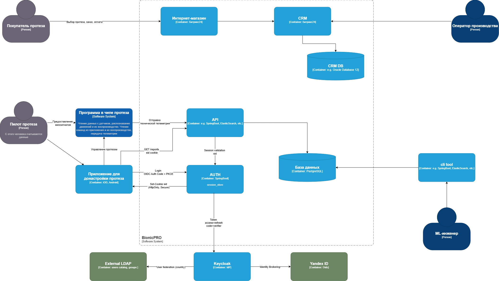
- [bionic-pro-auth-service.container.drawio](bionic-pro-auth-service.container.drawio)

### Замена Code Grant на PKCE.

- для перевода на PKCE внес изменения в приложение
    - ReactKeycloakProvider оберкта, которая обеспечивает OIDC -аутентификацию
        - pkceMethod: 'S256' включает PKCE

```
<ReactKeycloakProvider
            authClient={keycloak}
            initOptions={{
                onLoad:'login-required',
                pkceMethod: 'S256'
            }}
                  >
            <div className="App">
                <ReportPage/>
            </div>
        </ReactKeycloakProvider>
```

### Задача 3. Обеспечьте безопасное получение и хранение access-и refresh-токенов.

- убираем Keycloak (в том числе PKCE) из фронта
    - токены теперь не хранятья в браузере
    - авторизация через bionicpro-auth
    - запросы в API с кукой sid (полученной при авторизации)
- создали сервис bionicpro-auth (nodejs)
    - хранение токенов для sid в оперативной памяти тобишь session-store
    - получает токены access/refresh от Keycloak
    - отдает куку с сессией httpOnly
    - ротация id сессии
    - время жизни токена менее 2 минут
- создали сервис заглушку report-api
    - отдает пустой список из БД по ручке /report
- изменили настройки Keycloak
    - убрали клиента "фронт"
    - добавили клиента "bionicpro-auth"
- изменили ручки
    - GET /login - редирект на Keycloak из auth
    - GET /callback - Keycloak отдает на auth код-токен - создается sid
    - POST /sessions/validate - валидация - обновление токена (если просрочен) - ротация сессии
- в Keycloak добавили живучесть токенов 2 минут

```
realm-export.json

{
  "realm": "reports-realm",
  "enabled": true,
  "accessTokenLifespan": 120,
  "accessTokenLifespanForImplicitFlow": 120,
  
  ....
  
```

- в результате настройки auth сервиса
    - в браузер нету токенов
        - 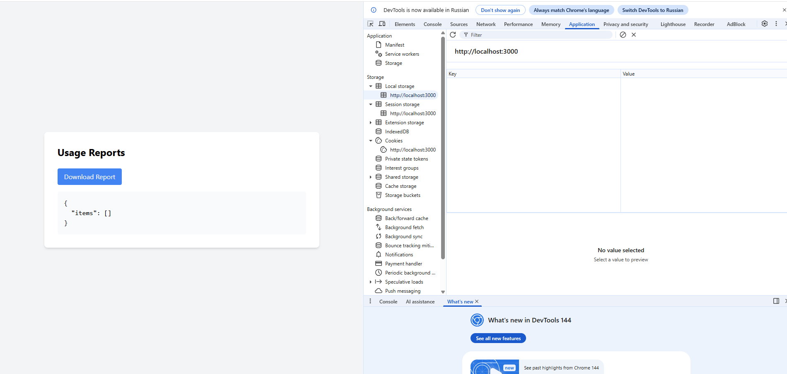
        - 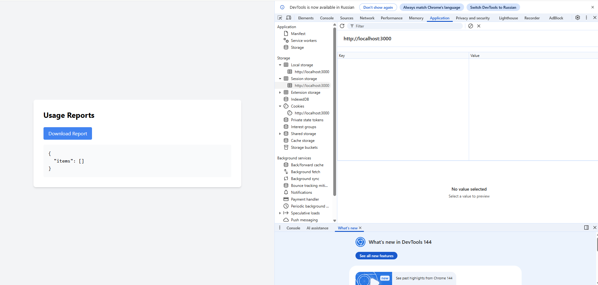
        - только кука от auth
            - 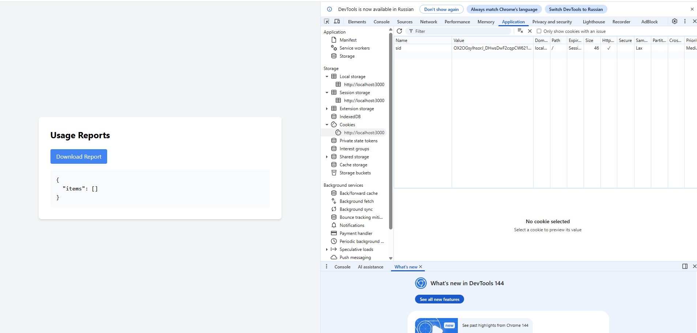
            - при этом разная при обновлении страницы, настроено валидация на фронте
    - в сервисе auth
        - видно, что при валидации меняется sid
        - и также произошло обновление токена
            - ttlSec: -69,
            - expired: true
        - [log_auth.rotaion.expired.txt](result/log_auth.rotaion.expired.txt)

## Добавил запуск всех сервисов через compose

- сервис auth, api
- отдельный контейнер (может временно) для API
- из корня - docker compose up -d --build

### Задача 4 LDAP

- поднял LDAP
    - добавил в компос openldap и phpldapadmin
    - вход по https://localhost:6443
        - cn=admin,dc=example,dc=com пароль admin
    - вот юзеры
        - 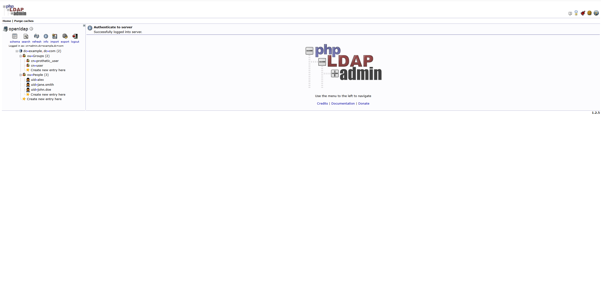
- добавляем в kaycloak ldap
    - заходим на вебморду localhost:8080 admin/admin
        - выбираем reports-realm
        - User federation → Add provider → ldap
        - далее несколько настроек
            - 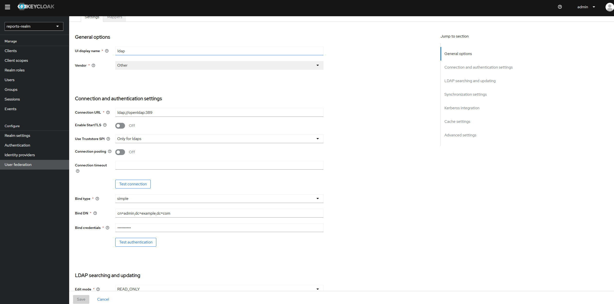
            - 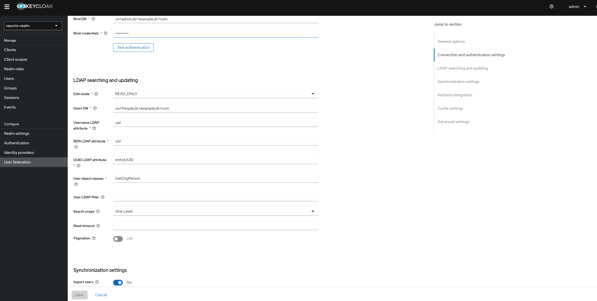
            - 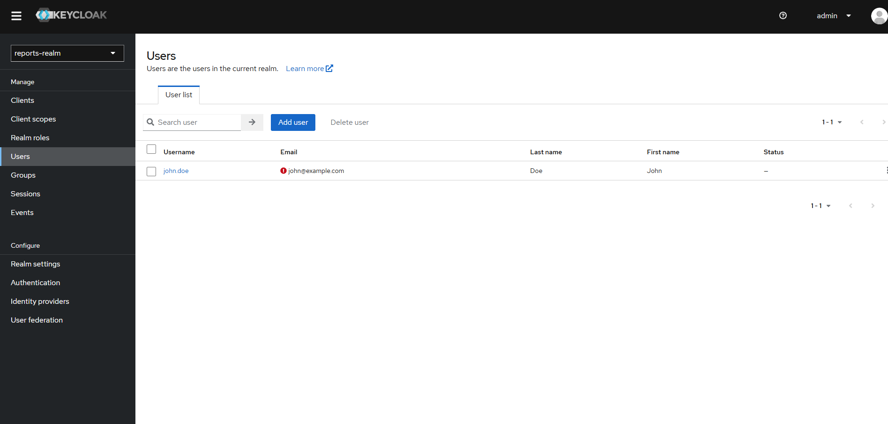
- проверяем вход в наш фронт по john@example.com/password заработало!!

### Задача добавляем MFA

- добавили в настройки Keycloak
    - Authentication -> Required Actions -> Configure OTP
        - Enabled → ON
        - Default Action → ON
    - теперь просит одноразовый пароль
        - 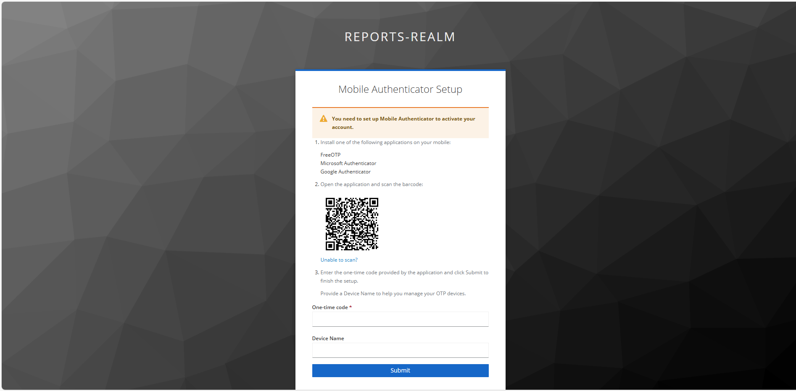

### Добавляем OAuth 2.0 от Яндекс ID.

- настраиваем приложение в Yandex OAuth
    - даем доступ почта, логин, имя
    - 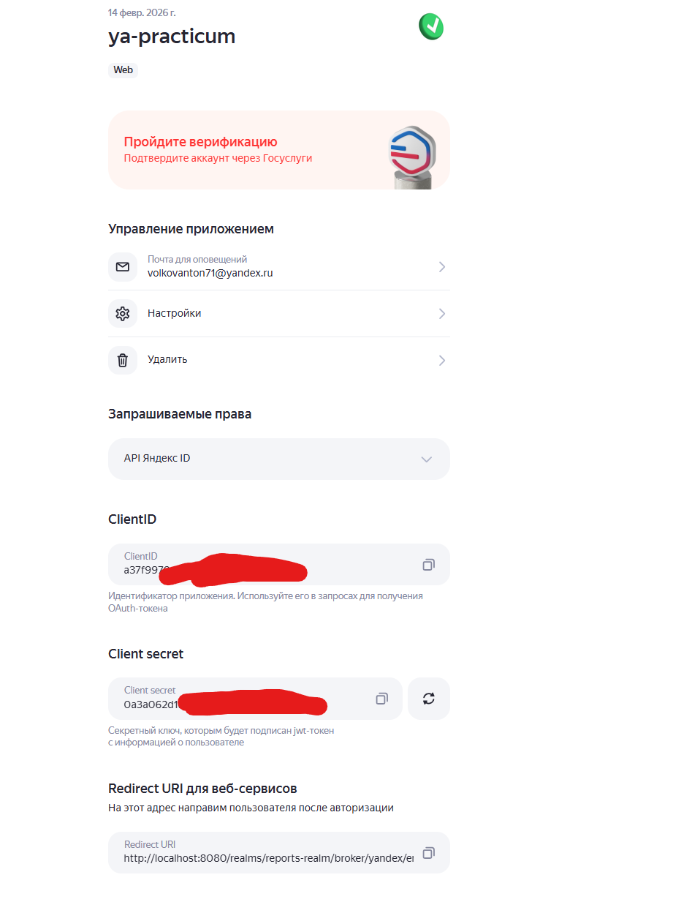
- настраиваем keycloak -> yandex как Identity Provider
    - 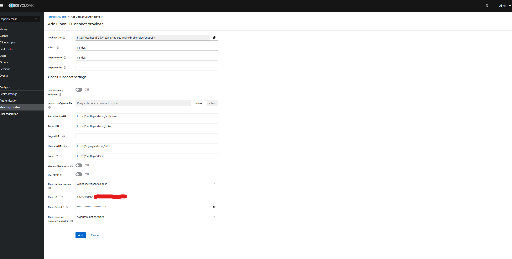
    - 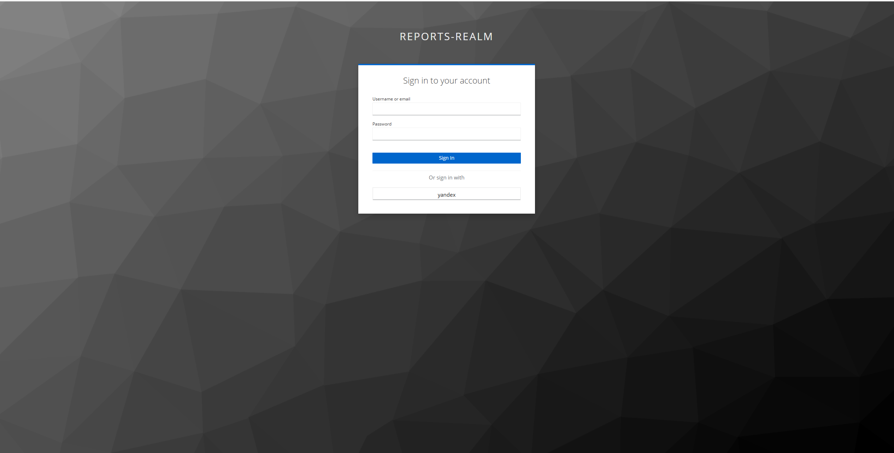
    - !!!!!!!хьюстон проблема
        - не проходит редирект после аутентификации в Яндексе
            - ошибки invalid_scope
                - в запросе keycloak шлет openid
            - оказалась проблема в версии контейнера quay.io/keycloak/keycloak:21.1.1
                - нет провайдера Yandex OAuth
                - и нет OAuthv2 как такового
                - а провайдер OpenID Connect v1.0 близок к Ya-OAuth но не рабоатает
            - заменил версию на image: playaru/keycloak-russian
                - и появились и OAuth v2, и Yandex provider - и все заработал!!

### Примечание

- ldap, Ya-OAuth, MFA - при начальном старте настраивается в ручную
    - по заданию не требуется автоматическое создание
    - можно добавить в realm-exports.json - но для учебного излишне, и секреты туда тоже не хочу класть