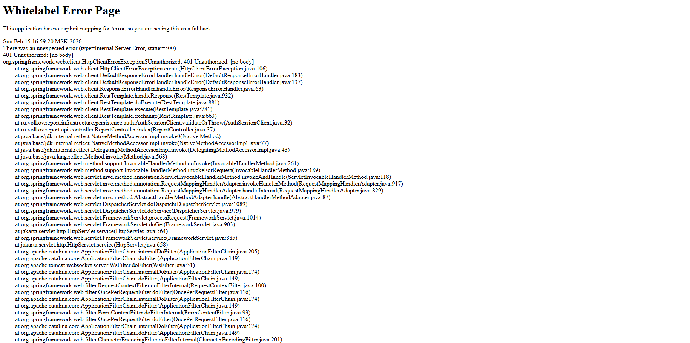
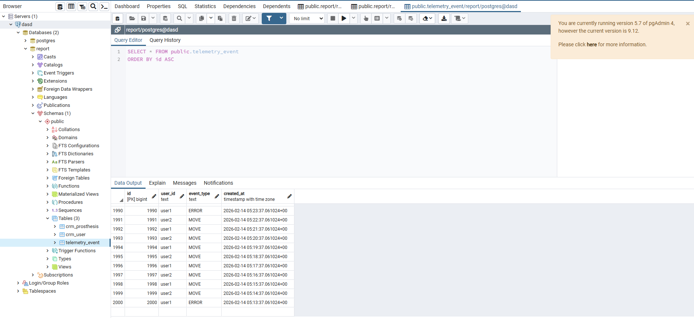
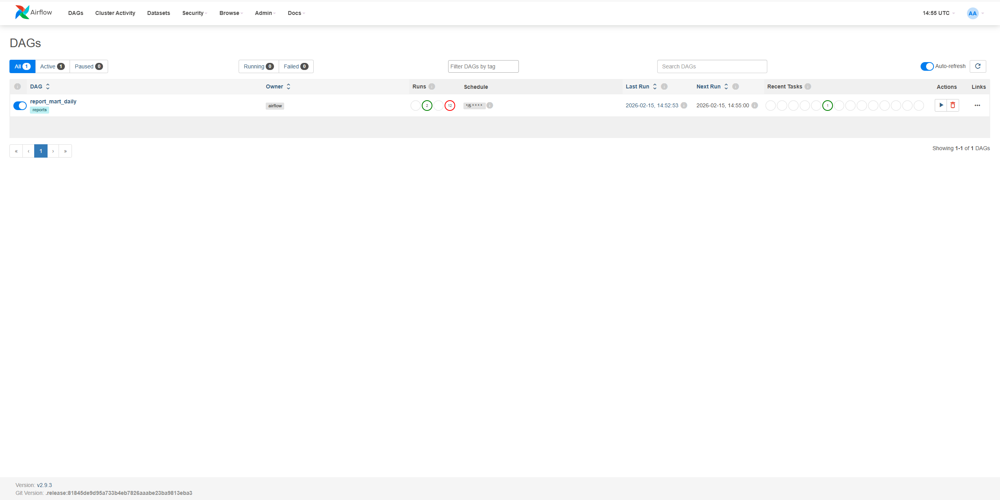
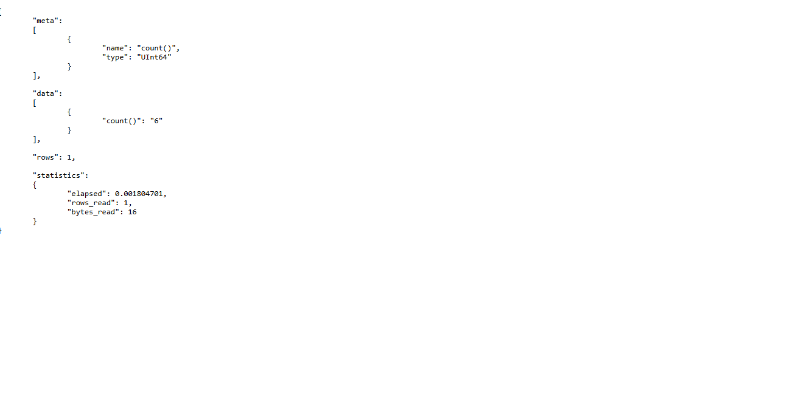
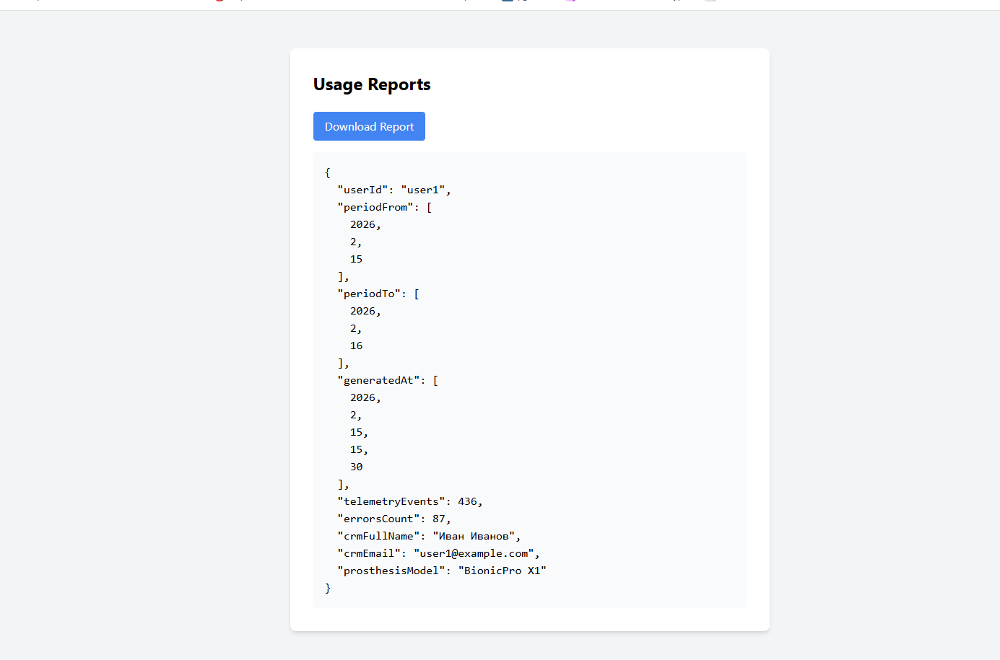
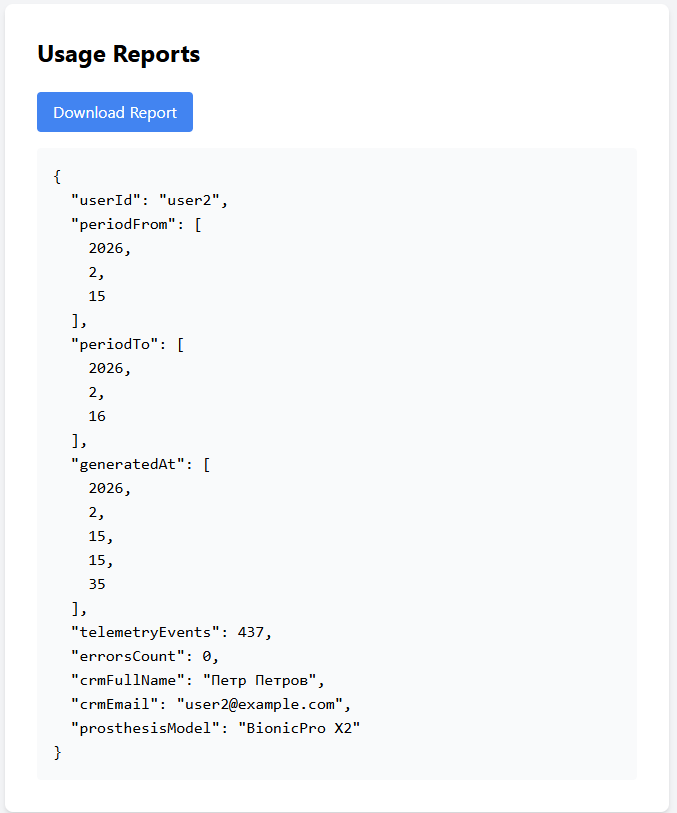
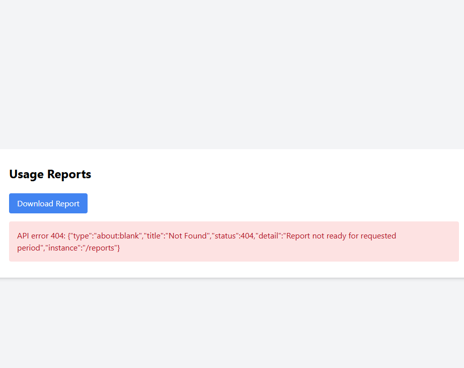

## Сервис отчетов

- добавили валидация через auth
    - перед выдачей данных вызывает bionicpro-auth POST /sessions/validate
    - bionicpro-auth проверяет sid из cookie, при необходимости делает refresh access-token и rotation sid,
        - возвращает { valid, userId, roles, newSid }
    - неавторизованный (нет cookie sid / sid неизвестен) получает 401
    - авторизованный проходит и может запросить отчёт
        - 

- добавили сервисы
    - clickhouse
        - OLAP БД - аналитика агрегация
    - airflow_db
        - Postgres для Airflow
    - airflow
        - оркестратор расписаний - он же планировщик - он же запускатор задач - он же..
        - по расписанию наполняет витрину в Clickhouse из каких-либо источников (тута Postgres)

- создали файлы
    - report-db/init/001_sources.sql
        - демо-данные, ибо реальных сервисов "CRM", "телеметрия" нету
            - crm_user, crm_prosthesis — демо "CRM"
            - telemetry_event — демо "телеметрия"
    - clickhouse/init/001_mart.sql
        - таблицу витрины reports.report_mart
        - готовый отчет для API типа быстро
    - airflow/dags/report_mart_daily.py
        - это DAG берет данные из Postgres (телеметрия, срм) агрегирует и пишет в кликхаус в report_mart

- запускаем докер
    - данные в report_db есть
        - 
    - DAG скрипт в airflow имеется
        - изначально падал скрипт
            - время парсил неккоректно
            - нельзя было попасть в кликхаус permission доступ
                - убрал в компосе volume для кликхауса
                - теперь работает dag
                    - 
                - и видно данные в кликхаусе если запросить в браузере
                - 
    - подкрутили API запрос в кликхаус
        - по умолчанию за поcледение сутки, дабы не трогать фронт (не усложнять from/to)
        - 
        - другой пользователь который тоже был проинициализорован
            - 
        - а для пользователя prothetic2@example.com" нету данных
            - 

- итого
    - /reports — возвращает последний подготовленный отчёт для текущего пользователя из витрины reports.report_mart (
      ClickHouse).
    - “Генерация” в онлайне не выполняет вычисления, а читает из витрины; наполнение витрины делает Airflow по
      расписанию.
    - Если пользователь запрашивает период/данные, которых ещё нет в витрине — API возвращает 404 Report not ready
    - UI кнопка вызывает /reports и получает подготовленный отчёт из OLAP.
    - Airflow отвечает за подготовку данных, API — за выдачу.