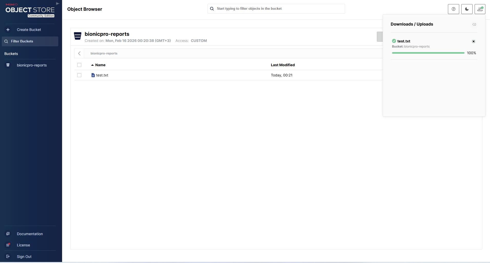
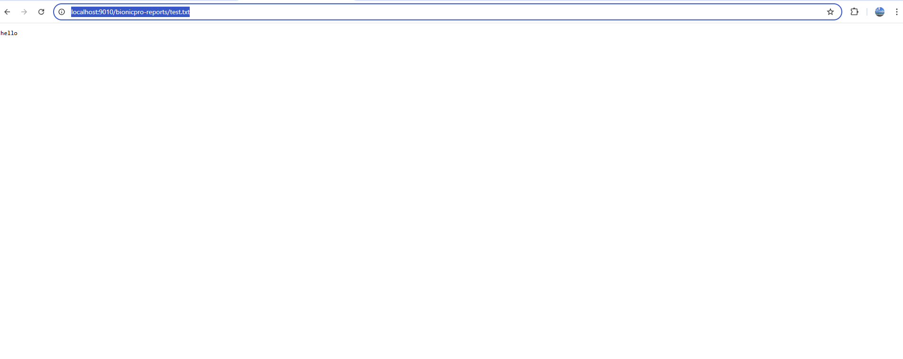
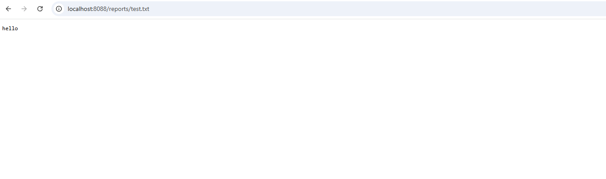
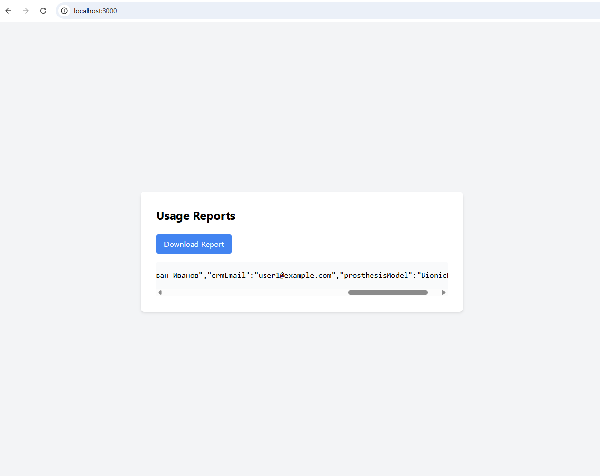

### Снижение нагрузки на базу данных

- создаем сервесы
    - minio
        - оно же S3 хранилка озеро
        - хранит готовые сформированные отчёты в виде файлов JSON
    - cdn
        - аля прокси кеш на ngnix еред Minio
        - включает proxy_cache
        - кеширует статические файлы отчётов
        - повторные запросы отдает из кеша (без обращения к Minio)

- поправляем report-api
    - пользователь делает запрос /reports
    - report-api валидирует сессию через bionicpro-auth
    - формируется ключ отчёта в S3:
        - reports/{userId}/daily/{yyyy-MM-dd}.json
    - если файл уже существует в S3 → возвращается ссылка на CDN
    - если файла нет:
        - отчёт читается из витрины ClickHouse
        - сериализуется в JSON
        - сохраняется в Minio
    - теперь API возвращает строку URL
        - { "url": "http://localhost:8088/reports/reports/user1/daily/2026-02-16.json" }


- проверяем
    - создаем тестовый файл в озере
        - заходим http://localhost:9001/browser/bionicpro-reports
            - закидываем тестовый файл
                - [test.txt](test.txt)
                - 
            - проверяем получение файла из озера
                - http://localhost:9010/bionicpro-reports/test.txt
                - 
            - проверяем из cdn из браузера
                - 
            - кеширование два запроса curl MISS в первом , HIT попадание во втором
                - 
    - делаем запрос уже реальных данных из UI
        - 
        - получили строку URL сделали запрос
      ```
          - {"userId":"user1","periodFrom":[2026,2,15],"periodTo":[2026,2,16],"generatedAt":[2026,2,15,21,30,1],"telemetryEvents":436,"errorsCount":87,"crmFullName":"Иван Иванов","crmEmail":"user1@example.com","prosthesisModel":"BionicPro X1"} 
      ```

