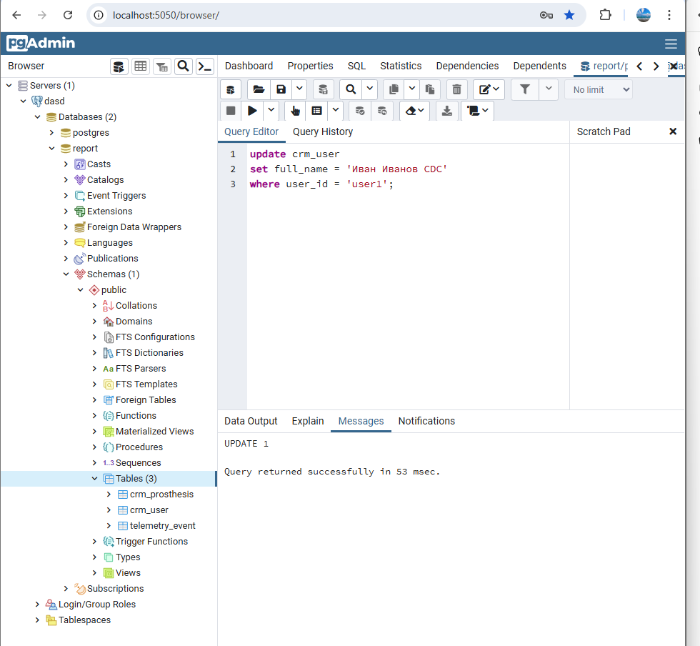
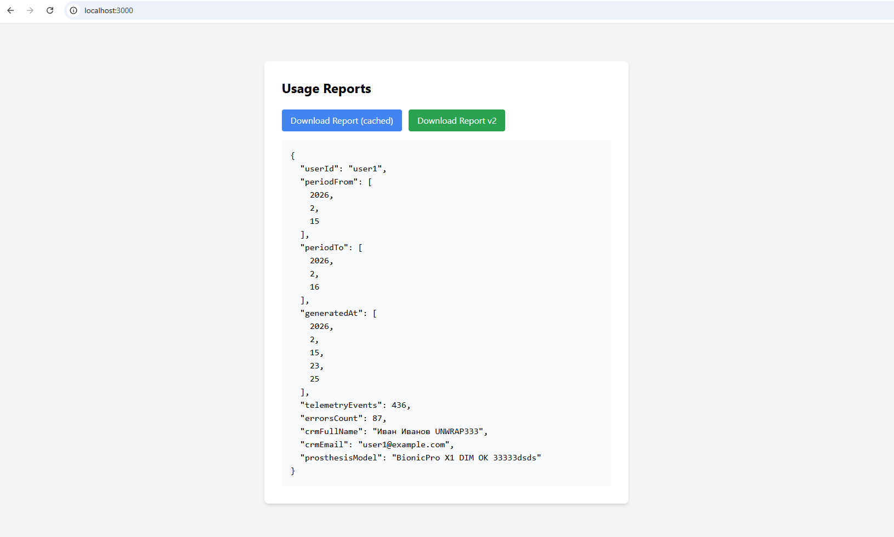
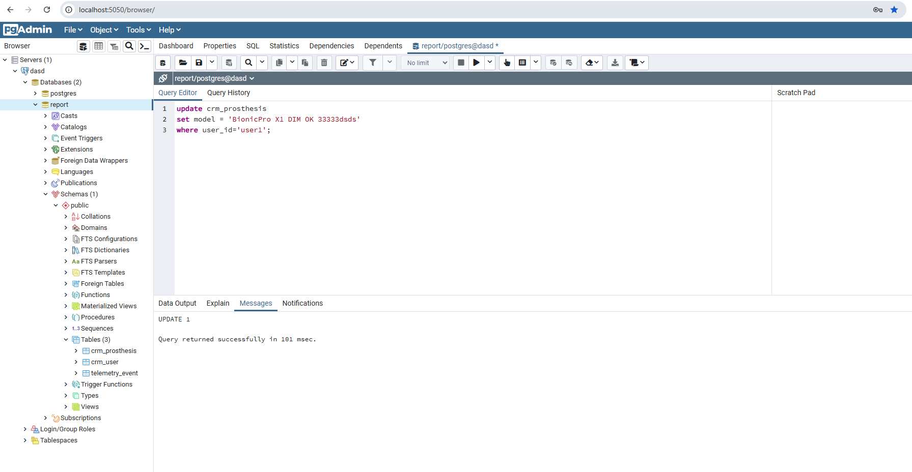

### Повышение оперативности и стабильности работы CRM

- добавляем сервисы
- kafka + zookepper
    - добавили wal_level report_db
        - чтобы Postgres отдавал изменения CDC для Debezium

- файлы
    - debezium/crm-connector.json
        - конфиг для Debezium Postgres Connector
            - какой url Postgres, какие таблицы отслеживать
            - как назвать топики
            - и как формировать сообщения
    - clickhouse/init/010_cdc.sql
        - инфраструктура приёма CDC в ClickHouse
        -
    - clickhouse/init/020_dims.sql
        - нормальные таблицы измерений (dim), которые читает витрина:
            - crm_user_dim
            - crm_prosthesis_dim

- CRM данные берём не из Postgres из ClickHouse dim быстро и без нагрузки на OLTP
    - делаем View в ClickHouse, который добавляет к report_mart актуальные поля из dim:
        - [030_report_mart_v2.sql](../clickhouse/init/030_report_mart_v2.sql)

- запустив все сервисы и иниты
    - делаем изменение в report-db
        - 
    - проверяем коннектор
  ```
  $ curl http://localhost:8083/connectors
  ["crm-postgres-connector"]

    ```
    - проверка статуса коннектора
      ```
      $ curl http://localhost:8083/connectors/crm-postgres-connector/status
        {"name":"crm-postgres-connector","connector":{"state":"RUNNING","worker_id":"172.18.0.18:8083"},"tasks":[{"id":0,"state":"RUNNING","worker_id":"172.18.0.18:8083"}],"type":"source"}

      ```

        - проверяем Kafka топик
            - [kafka-topic.txt](result/kafka-topic.txt)
            - op: r - первичная
            - op: u - обновили
            - [kafka-topic.txt](result/kafka-topic.txt)
        - проверяем из кликхауса raw (события дошли)
            - пока из браузера
                - http://localhost:8123/?query=SELECT%20count()%20AS%20cnt%20FROM%20reports.crm_user_raw%20FORMAT%20JSON
                    - cnt": "3" типа три события
                        - [clickhouse-count-reports.txt](result/clickhouse-count-reports.txt)
            - dimension таблицы (актуальное состояние)
                - http://localhost:8123/?query=SELECT%20*%20FROM%20reports.crm_user_dim%20FINAL%20FORMAT%20JSON
                - [clickhouse-payload.txt](result/clickhouse-payload.txt)
        - Postgres → Debezium → Kafka → ClickHouse raw → MV → dim работает.

- CDC: PostgreSQL → Kafka → ClickHouse (Dimension tables)
    - Проверка обновления CRM через CDC
    - обновляем запись в PostgreSQL

```
update crm_prosthesis
set model = 'BionicPro X1 DIM OK 33333'
where user_id='user1';

```

- Проверка в ClickHouse
    - http://localhost:8123/?query=SELECT%20*%20FROM%20reports.crm_prosthesis_dim%20FINAL%20WHERE%20user_id='user1'%20FORMAT%20JSON

```
{
	"meta":
	[
		{
			"name": "user_id",
			"type": "String"
		},
		{
			"name": "model",
			"type": "String"
		},
		{
			"name": "updated_at",
			"type": "DateTime"
		}
	],

	"data":
	[
		{
			"user_id": "user1",
			"model": "BionicPro X1 DIM OK 33333",
			"updated_at": "2026-02-15 22:56:21"
		}
	],

	"rows": 1,

	"statistics":
	{
		"elapsed": 0.002062164,
		"rows_read": 1,
		"bytes_read": 52
	}
}
```

- делаем вторую ручку для АПИ
    - API GE /reports/v2 - берет из витрины dim
    - она возвращает отчёт напрямую из ClickHouse витрины v2 (без S3/CDN)
    - /reports оставили как кешируемую версию через S3/CDN
    - получили изменные данные после update в БД
        - 
        - 