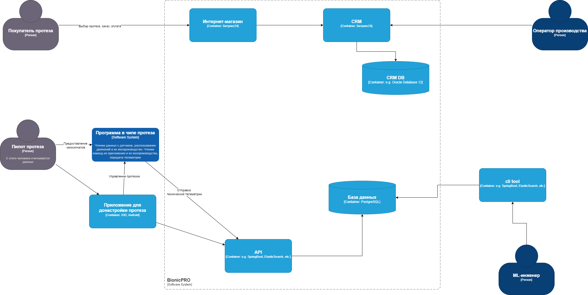

## git@github.com:AntonVolkov71/architecture-bionicpro.git
- обучают ML-модель данными клиентов
  - было раз в день через 4G-модуль
  - стало в реальном времени

- схема контенера
  - 

- компоненты в IT-системе
  - программа в чипе протеза
  - приложение для донастройки
  - интернет-магазин
  - CRM

- проблемы
  - был взлом, похищение данных
  - передавать огромный объем данных в приложение на телефон
  - выход на зарубежные рынки - соблюдение законодательства

- цели
  - усилить безопасность
  - отдельное приложение выгрузки данных для клиента (только своих)
  - 